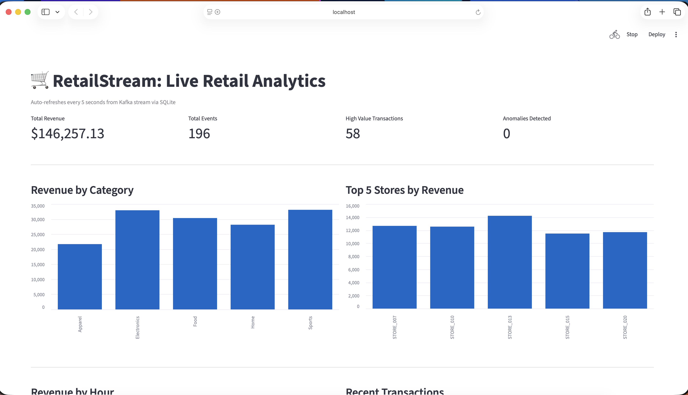
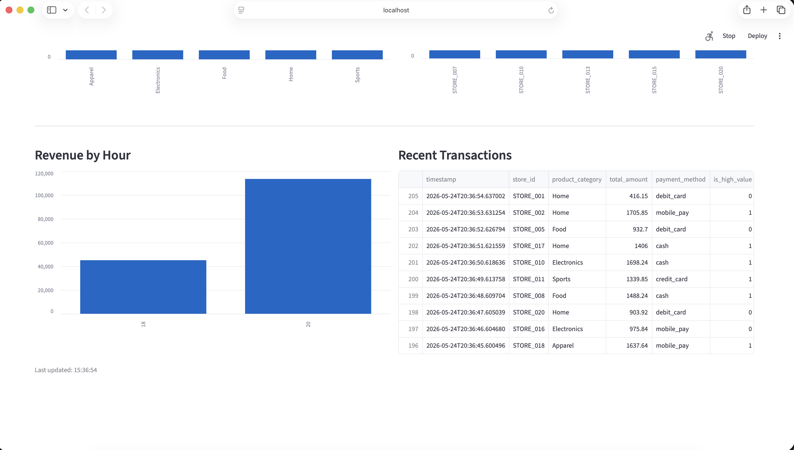
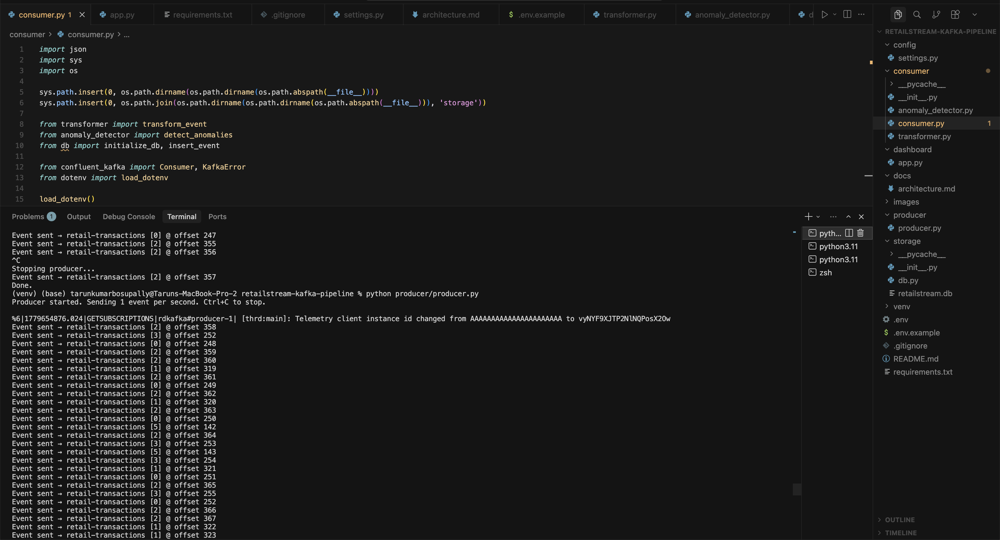

# RetailStream: Real-Time Retail Event Streaming Pipeline

A real-time streaming pipeline that ingests simulated retail transaction events through Confluent Cloud Kafka, transforms and validates them in Python, stores results in SQLite, and visualizes live KPIs on a Streamlit dashboard that updates every 5 seconds.

## Business Problem

Retail operations teams need to monitor transaction health, revenue trends, and store performance in real time. Batch reports from the night before are too slow for operational decisions. This pipeline simulates a retail POS event stream, processes events as they arrive, and surfaces live KPIs so teams can act on what is happening now.

## Target Stakeholder

Retail Operations Manager or Store Analytics team needing live transaction monitoring across locations.

## Architecture

```text
[ Python Producer ]
  Generates synthetic retail transaction events
  Publishes to Confluent Cloud Kafka topic: retail-transactions
  Rate: 1 event per second
        |
        v
[ Confluent Cloud Kafka ]
  Managed Kafka broker (free tier)
  Topic: retail-transactions
  Partitions: 6
        |
        v
[ Python Consumer ]
  Subscribes to retail-transactions topic
  Transformer: adds revenue, is_high_value, hour_of_day fields
  Anomaly Detector: flags missing fields, negative amounts, outliers
  Writes all events to SQLite
        |
        v
[ SQLite Database ]
  Tables: raw_events, anomalies
        |
        v
[ Streamlit Dashboard ]
  Auto-refreshes every 5 seconds
  KPIs: Total Revenue, Events, High Value Transactions, Anomalies
  Charts: Revenue by Category, Top Stores, Revenue by Hour
  Table: Recent Transactions
```

## Tech Stack

| Tool | Purpose |
|---|---|
| Confluent Cloud | Managed Kafka broker |
| Python | Producer and consumer scripts |
| confluent-kafka | Python Kafka client |
| SQLite | Lightweight results storage |
| Streamlit | Live dashboard |
| pandas | Data transformation |

## Project Structure

```text
retailstream-kafka-pipeline/
  producer/
    producer.py
  consumer/
    consumer.py
    transformer.py
    anomaly_detector.py
  storage/
    db.py
  dashboard/
    app.py
  config/
    settings.py
  docs/
    architecture.md
  images/
  .env.example
  .gitignore
  README.md
  requirements.txt
```

## KPIs

| KPI | Definition |
|---|---|
| Total Revenue | Sum of all transaction amounts consumed so far |
| Events Per Session | Total events processed by the consumer |
| High Value Transactions | Events where total amount exceeds $1,000 |
| Anomalies Detected | Events with missing fields, negative amounts, or outlier prices |

## Setup Instructions

### 1. Clone the repo

```bash
git clone https://github.com/YOUR_USERNAME/retailstream-kafka-pipeline.git
cd retailstream-kafka-pipeline
```

### 2. Create virtual environment

```bash
python -m venv venv
source venv/bin/activate
pip install -r requirements.txt
```

### 3. Configure environment variables

```bash
cp .env.example .env
```

Edit `.env` with your Confluent Cloud credentials:
KAFKA_BOOTSTRAP_SERVERS=your-bootstrap-server.confluent.cloud:9092
KAFKA_API_KEY=your_api_key
KAFKA_API_SECRET=your_api_secret
KAFKA_TOPIC=retail-transactions

### 4. Run the pipeline

Terminal 1:
```bash
python producer/producer.py
```

Terminal 2:
```bash
python consumer/consumer.py
```

Terminal 3:
```bash
streamlit run dashboard/app.py --server.fileWatcherType none
```

## Dashboard Screenshots





## Data Quality Checks

- Missing required fields flagged as anomalies
- Negative or zero transaction amounts flagged
- Outlier transactions above $5,000 flagged
- All events tagged with is_high_value and hour_of_day for segmentation

## Limitations

- Synthetic data only (no real POS integration)
- SQLite not suited for high-volume production writes
- No schema registry (JSON serialization only)
- Single consumer instance

## What This Project Demonstrates

- Real-time event streaming with Kafka
- Python producer and consumer architecture
- Data transformation and anomaly detection
- Live dashboard with auto-refresh
- End-to-end pipeline from event generation to visualization