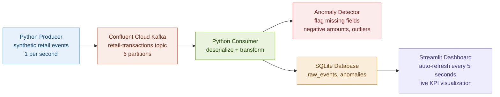

# RetailStream: Real-Time Retail Event Streaming Pipeline

> Retail operations teams need live transaction visibility. Batch ETL delivers yesterday's data. This pipeline delivers now.

## Problem

Retail event systems produce delayed operational insights due to batch ETL latency. Store managers, operations leads, and analytics teams cannot act on data that is 8 to 24 hours old. Anomalies go undetected. Revenue opportunities are missed.

## Solution

A real-time streaming pipeline that ingests simulated retail POS events through Confluent Cloud Kafka, transforms and validates them in Python, stores aggregated results in SQLite, and surfaces live KPIs on a Streamlit dashboard that auto-refreshes every 5 seconds.

## Architecture



## Features

- Real-time event ingestion from Confluent Cloud Kafka at 1 event per second
- Python consumer with transformation layer adding revenue, high-value flag, and hour-of-day fields
- Anomaly detection flagging missing fields, negative amounts, and outlier transactions above $5,000
- SQLite storage for raw events and anomaly log
- Streamlit dashboard with 5-second auto-refresh showing live KPIs and charts

## Dashboard Screenshots


## KPIs

| KPI | Definition |
|---|---|
| Total Revenue | Sum of all transaction amounts consumed so far |
| Events Per Session | Total events processed by the consumer |
| High Value Transactions | Events where total amount exceeds $1,000 |
| Anomalies Detected | Events with missing fields, negative amounts, or outlier prices |

## Performance Characteristics

| Metric | Value |
|---|---|
| Event throughput | 1 event per second (configurable) |
| Dashboard refresh rate | Every 5 seconds |
| Kafka partitions | 6 |
| Anomaly detection latency | Real-time, per event |

## Tech Stack

| Tool | Purpose |
|---|---|
| Confluent Cloud | Managed Kafka broker, free tier |
| Python | Producer and consumer pipeline |
| confluent-kafka | Python Kafka client |
| SQLite | Lightweight results storage |
| Streamlit | Live KPI dashboard |
| pandas | Data transformation |

## Project Structure

```text
retailstream-kafka-pipeline/
  producer/
    producer.py          (event generation and publishing)
  consumer/
    consumer.py          (Kafka subscriber and orchestrator)
    transformer.py       (field enrichment logic)
    anomaly_detector.py  (validation and flagging)
  storage/
    db.py                (SQLite setup and write functions)
  dashboard/
    app.py               (Streamlit live dashboard)
  config/
    settings.py          (Kafka config, thresholds)
  .env.example
  requirements.txt
  README.md
```

## How to Run

```bash
git clone https://github.com/Tarun-B-12/retailstream-kafka-pipeline.git
cd retailstream-kafka-pipeline
python -m venv venv
source venv/bin/activate
pip install -r requirements.txt
cp .env.example .env
```

Edit `.env` with your Confluent Cloud credentials:
KAFKA_BOOTSTRAP_SERVERS=your-bootstrap-server.confluent.cloud:9092
KAFKA_API_KEY=your_api_key
KAFKA_API_SECRET=your_api_secret
KAFKA_TOPIC=retail-transactions

Then run in three separate terminals:

```bash
python producer/producer.py
python consumer/consumer.py
streamlit run dashboard/app.py --server.fileWatcherType none
```

## Limitations

- Synthetic data only, no real POS integration
- SQLite is not suited for high-volume production writes. Production version would use PostgreSQL or DuckDB
- No schema registry, JSON serialization only
- Single consumer instance, no consumer group scaling

## Future Improvements

- Kubernetes deployment for consumer scaling
- Schema registry with Avro serialization
- Dead-letter queue for failed events
- Replace SQLite with DuckDB or PostgreSQL
- Add Kafka consumer lag monitoring
- Connect to a live POS data source

## What This Project Demonstrates

- Real-time event streaming architecture with Kafka
- Producer and consumer design patterns
- Data transformation and anomaly detection in a streaming context
- Live dashboard with auto-refresh from a streaming data source
- End-to-end pipeline from synthetic event generation to visualization
